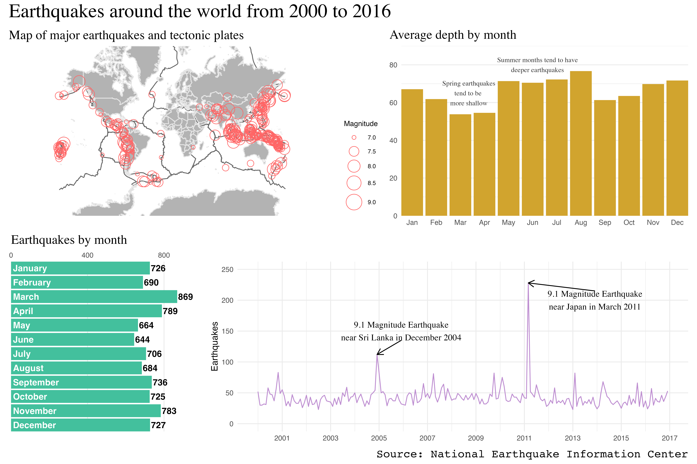

# STA309 Midterm 2
## Josh Roach

I went through a lot of different ideas for plots to create for this dashboard because of how broad the guidelines for the assignment was. I didn't narrow down a topic for the dashboard until later into the project, when I decided it would be interesting to only look at earthquakes since the year 2000. This gave me a more manageable dataset to work with in order to make meaningful plots and in turn a meaningful dashboard. 

### Plot 1
The first plot I knew I wanted was a map that would allow me to visualize where the earthquakes were occuring as well as how powerful they were. My original plot included every earthquake in the dataset, which created an unreadable plot that did nothing to enhance understanding of the topic. I then decided to filter down to only earthquakes since 2000, which ended up being what I created the dashboard around in the end. Still, the map was too cluttered and did little for readers, so I narrowed it down to only "Major Earthquakes", which are defined as any earthquake with a magnitude of 7.0 or higher. Throughtout these iterations of the map, I realized that the earthquakes were almost exclusively in lines that formed shapes across the globe, which I attributed to the tectonic plates. I decided to add the plates to the map to show readers why the earthquakes are happening in these particular patterns.

### Plot 2
The second plot I was originally planning on creating was a scatterplot graphing Magnitude against Depth of each earthquake, and then I would add a correlation line if they were somewhat strongly correlated. When I plotted the scatterplot, I realized that the two are not strongly correlated at all, and the plot didn't do anything meaningful. That's when I decided to look at the average depth of an earthquake within each month to see if there was some correlation between time of year and depth. The easiest way to plot this was to make a bar plot showing the average depth in each month since 2000. The plot appears to show that the summer months on average produce some of the deepest earthquakes, while the spring months on average produce some of the shallowest earthquakes.

### Plot 3
The third plot was planned to look at how many earthquakes occured during each month during the year. I originally planned on looking at just one year or taking averages, but I thought it would be more beneficial to look at how many total earthquakes occured in each month since I narrowed the dashboard down to only earthquakes since 2000. The plot shows that the months of March, April, and November had the most earthquakes, while June, May, and August had the least earthquakes. This does not take into account depth or magnitude of any of the earthquakes, but simply examines the frequencies in each month. 

### Plot 4
The final plot I wanted to examine was a time series plot showing the amount of earthquakes over time. Originally, I planned at looking at the amount of earthquakes per year within the dataset, but after narrowing down to after 2000, I decided to look at the amount in each month since January of 2000. I tried to plot only by year since 2000, but the plot was extremely boring and didn't give me any sort of story to tell. The plot by months however gives a very interesting story. When viewing the plot at first, there is one major peak as well as a second, lesser peak. At first it didn't seem to make much sense but I remembered what happened during each of those months in earthquakes. The largest peak occured during March of 2011, while the second peak occured during December of 2004, which both happened to contain the two strongest earthquakes since 2000. The earthquake on December 26, 2004 had a Magnitude of 9.1 and occured in the Indian Ocean, while the eqarthquake on March 11, 2011 occured off thecoast of Japan with a magnitude of 9.1. It seems extremely likely that these earthquakes would have an effect on the total number of earthquakes in that month, which tells a fascinating yet terrifying story. There is likely a story to be found in each of the smaller peaks, which could be an interesting project for the future.

### Final observations
While each of these plots have a story to tell on their own, putting them into a dashboard allows those stories to develop further and create new stories. One of the first things I noticed in the dashboard is that the month with the most earthquakes (March) also was the same month with the major peak in the time series plot due to the Japan earthquake of 2011. March of 2011 had 228 earthquakes, accounting for over a quarter of the total earthquakes in March over a 16 year period. Another interesting story is in the comparison between the bar plots. March and April had the most total earthquakes, but had the lowest average depth of earthquakes. Conversely, May, June, and August had the lowest amount of earthquakes but were all in the top four months with the highest average depth. This is also a topic that could be the subject of a future study. Overall, I'm pretty happy with the way my dashboard turned out because it is aesthetically pleasing and informative to the point that I learned just by building the plots. 

